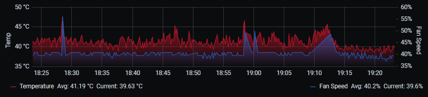

# IPMI Fan Control Daemon

This script controls IPMI compatible server's fan speeds in response to CPU Temperatures provided by lm-sensors.
This script has been tested on a Dell PowerEdge R210 II in a homelab environment, but should work on any IPMI compatible server.



#### NOTE: 
The script puts your server into "Full Fan Speed Mode", and then modifies what "Full Speed" means,
You have to manually use IPMI to set it to e.g. "Optimal" when you're not using the script.

#### NOTE: 
You use this script at your own risk, and no warranty is provided. Do not use in produciton environments.

* Maintainer: Brian Wilson <brian@wiltech.org>
* Original Author: Layla Mah <layla@insightfulvr.com>
* Original Version: https://github.com/missmah/ipmi_tools

### What's new?
The original script provided a "step" approach where fans would take large "steps" depending on the temps.
In this version, scalar equations are generated to provide an easy (and quiet) slope to follow to the next step.
These equations are simple Y=mx+b linear slopes that effectivly provide a fan "curve" based on the entries in the
`%cpu_temp_to_fan_speed` hash table.

### Installation and Usage
```sh
# Verify IPMI modules are loaded
lsmod | grep -i ipmi

# Install
cp ipmi_fancontrol-ng /usr/bin/
cp ipmi_fancontrol-ng.service /usr/lib/systemd/system/

# Enable on boot and start
systemctl enable ipmi_fancontrol-ng
systemctl start ipmi_fancontrol
```

### InfluxDB & Telegraf
Metrics are output to the file `/tmp/fan_speed_telegraf` by default and can be input into InfluxDB with the following Telegraf config block:
```
[[inputs.exec]]
  commands = [
    "/usr/bin/cat /tmp/fan_speed_telegraf"
  ]

  timeout = "5s"
  data_format = "influx"
```
#### Metrics Available
* Fan Speed %
* Fan Speed HEX

---
More documentation is planned, however I am available to answer basic configuration questions in the mean time.

